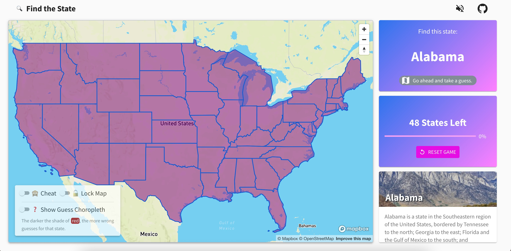

# Find the State UI

Find all the States in the contiguous USA on a map. Simple enough.

- [Live URL](https://jolly-murdock-43b71d.netlify.app/)
- [Frontend UI GitHub](https://github.com/johndatserakis/find-the-state-ui) - Built with TypeScript and React
- [Backend API GitHub](https://github.com/johndatserakis/find-the-state-api) - Built with Python and FastAPI

## Run

```bash
# Install deps
yarn

# Run
yarn start

# Build
yarn build

# Run tests
yarn test
```

## Built With

- React
- TypeScript
- Material-UI
- Recoil
- Styled-Components
- Mapbox
- React-Spring
- use-sound

## Notes

I used a few new libraries during the building of this project. I took some notes on things I needed to reference often.

## [Recoil](https://recoiljs.org/docs/introduction/installation)

<details>
<summary>Notes</summary>

### Basics

Info from the docs:

#### [atoms](https://recoiljs.org/docs/api-reference/core/atom)

An atom represents state in Recoil. The atom() function returns a writeable RecoilState object.

Most often, you'll use the following hooks to interact with atoms:

- `useRecoilState`: Use this hook when you intend on both reading and writing to the atom. This hook subscribes the component to the atom.
- `useRecoilValue`: Use this hook when you intend on only reading the atom. This hook subscribes the component to the atom.
- `useSetRecoilState`: Use this hook when you intend on only writing to the atom.
- `useResetRecoilState`: Use this hook to reset an atom to its default value.
- For rare cases where you need to read an atom's value without subscribing to the component, see `useRecoilCallback`.

```tsx
import { atom, useRecoilState } from 'recoil';

const counter = atom({
  key: 'myCounter',
  default: 0,
});

function Counter() {
  const [count, setCount] = useRecoilState(counter);
  const incrementByOne = () => setCount(count + 1);

  return (
    <div>
      Count: {count}
      <br />
      <button onClick={incrementByOne}>Increment</button>
    </div>
  );
}
```

#### [selector](https://recoiljs.org/docs/api-reference/core/selector)

Selectors represent a function, or derived state in Recoil. You can think of them as similar to an "idempotent" or "pure function" without side-effects that always returns the same value for a given set of dependency values. If only a get function is provided, the selector is read-only and returns a RecoilValueReadOnly object. If a set is also provided, it returns a writeable RecoilState object.

```tsx
import {atom, selector, useRecoilState, DefaultValue} from 'recoil';

const tempFahrenheit = atom({
  key: 'tempFahrenheit',
  default: 32,
});

const tempCelsius = selector({
  key: 'tempCelsius',
  get: ({get}) => ((get(tempFahrenheit) - 32) * 5) / 9,
  set: ({set}, newValue) =>
    set(
      tempFahrenheit,
      newValue instanceof DefaultValue ? newValue : (newValue * 9) / 5 + 32
    ),
});

function TempCelsius() {
  const [tempF, setTempF] = useRecoilState(tempFahrenheit);
  const [tempC, setTempC] = useRecoilState(tempCelsius);
  const resetTemp = useResetRecoilState(tempCelsius);

  const addTenCelsius = () => setTempC(tempC + 10);
  const addTenFahrenheit = () => setTempF(tempF + 10);
  const reset = () => resetTemp();

  return (
    <div>
      Temp (Celsius): {tempC}
      <br />
      Temp (Fahrenheit): {tempF}
      <br />
      <button onClick={addTenCelsius}>Add 10 Celsius</button>
      <br />
      <button onClick={addTenFahrenheit}>Add 10 Fahrenheit</button>
      <br />
      <button onClick={reset}>>Reset</button>
    </div>
  );
}
```

</details>

## [MUI](https://material-ui.com/components/box/)

- [Material Design Library docs](https://material.io/components)

### [Default Breakpoints](https://material-ui.com/customization/breakpoints/)

Using `md` `960` as main breakpoint. But using `xl` for breakpoint in container.

- xs, extra-small: 0px
- sm, small: 600px
- md, medium: 960px
- lg, large: 1280px
- xl, extra-large: 1920px

### [Container](https://material-ui.com/components/container/)

Make sure all base content is wrapped in a `Container` and use a consistent maxWidth across the app.

```tsx
<Container maxWidth="xl">...</Container>
```

### [Grid](https://material-ui.com/components/grid/)

For some reason the main `Grid` from MUI doesn't come with a full height and width. Import the `Grid` from `'./components/mui/Grid'` to get that added by default.

### [Access MUI styles in Styled-Components](https://material-ui.com/guides/interoperability/#theme)

```tsx
const Container = styled.div`
  background-color: ${({ theme }) => theme.palette.primary.main};
  box-shadow: ${({ theme }) => theme.shadows[3]};
  color: ${({ theme }) => theme.palette.text.primary}; // primary font color
  color: ${({ theme }) => theme.palette.text.secondary}; // muted font color
  background: ${({ theme }) => theme.palette.background.default}; // page background color
`;
```

### [Typography Components](https://material-ui.com/components/typography/#component)

### [Default Theme Object](https://material-ui.com/customization/default-theme/?expand-path=$.typography#explore)

### [Icon List](https://material-ui.com/components/material-icons/)

### [Palette](https://material-ui.com/system/palette/#palette)

## CSS

### Sixteenths for rem spacing

```bash
16/16 - 1
15/16 - 0.9375
14/16 - 0.875
13/16 - 0.8125
12/16 - 0.75
11/16 - 0.6875
10/16 - 0.625
9/16 - 0.5625
8/16 - 0.5
7/16 - 0.4375
6/16 - 0.375
5/16 - 0.3125
4/16 - 0.25
3/16 - 0.1875
2/16 - 0.125
1/16 - 0.0625
```

## [React Spring](https://www.react-spring.io/docs/hooks/basics)

- There's an issue with the documentation for `useTransition` mentioned [here](https://github.com/pmndrs/react-spring/issues/1052#issuecomment-805398650)
- Concerning casting in `from`: [comment](https://github.com/microsoft/TypeScript/issues/11465#issuecomment-252453037)

## [Mapbox / Mapbox GL JS](https://docs.mapbox.com/mapbox-gl-js/api/)

- [API reference](https://docs.mapbox.com/mapbox-gl-js/api/)
- [Examples](https://docs.mapbox.com/mapbox-gl-js/example/)
- [Mapbox terminology explanation](https://stackoverflow.com/a/66379033/8014660)
- [Good info on how to style a Choropleth](https://dev.to/laney/mapbox-how-to-conditionally-style-features-based-on-covid-19-data-h78)

### Basics

#### Sources

`Sources` are like data stores in the map. You then use `layers` to visually represent the data.

In this app, the main `source` is the states data loaded from `'https://docs.mapbox.com/mapbox-gl-js/assets/us_states.geojson'` as `geojson`.

Types of sources:

- `GeoJSON`
- `Vector Tilesets`

#### Layers

`Layers` are considered the visual representation of a `source`. There can be multiple `layers` representing a `source`:

- `fill`: represents boundaries as shared polygons
- `line`: represents boundaries as an outline
- `symbol`: represents text labels

#### [Features](https://docs.mapbox.com/help/glossary/features/)

A `feature` is an individual (or in some cases, a group of) points, lines, or polygons in a dataset or in a tileset. These points, lines, and polygons represent an entity in the real world, such as a landmark, a road, or a park. A feature contains:

- `Geometry`: The shape and the location of each feature.
- `Properties`: This can contain any JSON object. Some examples of common properties, often known as metadata, include title and description.

#### [Dataset](https://docs.mapbox.com/help/glossary/dataset/)

A dataset is an editable collection of GeoJSON features that you can store in your Mapbox account and access or edit as needed.

#### [Tileset](https://docs.mapbox.com/help/glossary/tileset/)

A tileset is a collection of raster or vector data broken up into a uniform grid of square tiles at 22 preset zoom levels. In Mapbox libraries and SDKs, tilesets are necessary to make maps visible on mobile devices or in the browser. They are cacheable and load quickly, and Mapbox relies heavily on tilesets to keep our maps performant.

### Notes

Was using `https://docs.mapbox.com/mapbox-gl-js/assets/us_states.geojson` as my `states` `geojson` `source` before. Now importing it directly.

## Favicons

I found [favicon.io](https://favicon.io/) randomly. I dig it because it made using an emoji as the favicon easy.

## Sound

- Used [use-sound](https://github.com/joshwcomeau/use-sound) to play the music.
- Got the music from [here](https://freemusicarchive.org/music/The_United_States_Army_Old_Guard_Fife_and_Drum_Corps/Celebrating_50_Years).

## Other Notes

This project was made with The Libertines "Don't Look Back Into the Sun - EP" [(Apple Music)](https://music.apple.com/gb/album/dont-look-back-into-the-sun-ep/259850329) [(Spotify)](https://open.spotify.com/album/4p8bvIgDBZ7eLvuflo6YhI?highlight=spotify:track:4KspXoCVJXGY1VrvEe1Hdm) playing.

## License

[MIT](http://opensource.org/licenses/MIT)

## Screenshot

[](https://jolly-murdock-43b71d.netlify.app/)
