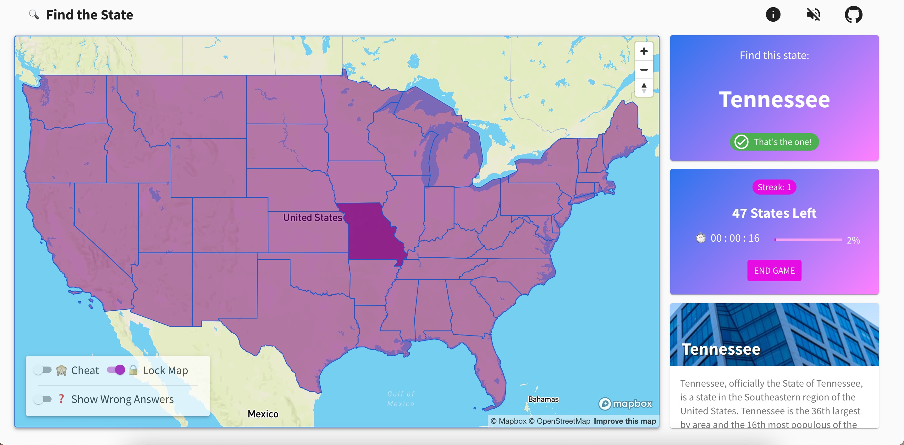

# Find the State UI

[](https://find-the-state.netlify.app/)

Find all the States in the contiguous USA on a map. Simple enough.

- [Live URL](https://find-the-state.netlify.app/)
- [Frontend UI GitHub](https://github.com/johndatserakis/find-the-state-ui) - Built with TypeScript, React, and Next.js
- [Backend API GitHub](https://github.com/johndatserakis/find-the-state-api) - Built with Python and FastAPI

## Run

```bash
# Install deps
yarn

# Run locally
yarn dev

# Build
yarn build:static

# Run unit tests
yarn test:unit

# Run e2e tests
yarn test:e2e

# Run headless e2e tests
yarn test:e2e:headless

# Run all tests
yarn test
```

## Built With

- React
- TypeScript
- Next.js
- Material-UI
- Styled-Components
- Mapbox
- use-sound
- useSWR

I used a few new libraries during the building of this project. I took some notes below on things I needed to reference often, both new and old.

## Folder Structure

For the most part, the structure of the project is what you'd expect from a normal Next.js app. The main thing I wanted to point out was that I use a `./src/program` folder that mirrors the main `./src` structure, but is specifically for files that are unique to this project. The reason I do this is because I share a lot of the same "base" code in my projects, so this lets me iterate as I make new projects, building up my base, while keeping my "program" files somewhat separate.

## MUI

- [Material Design Library docs](https://material.io/components)

### [Typography Components](https://mui.com/components/typography/#component)

### [Default Theme Object](https://mui.com/customization/default-theme/?expand-path=$.typography#explore)

### [Icon List](https://mui.com/components/material-icons/)

### [Palette](https://mui.com/system/palette/#palette)

### [DataGrid](https://mui.com/components/data-grid/#mit-version)

- [DataGrid API](https://mui.com/api/data-grid/)

## Mapbox / Mapbox GL JS

- [API reference](https://docs.mapbox.com/mapbox-gl-js/api/)
- [Examples](https://docs.mapbox.com/mapbox-gl-js/example/)
- [Mapbox terminology explanation](https://stackoverflow.com/a/66379033/8014660)
- [Good info on how to style a Choropleth](https://dev.to/laney/mapbox-how-to-conditionally-style-features-based-on-covid-19-data-h78)

### Mapbox Basics

#### Sources

`Sources` are like data stores in the map. You then use `layers` to visually represent the data.

In this app, the main `source` is the states data loaded from `'https://docs.mapbox.com/mapbox-gl-js/assets/us_states.geojson'` as `geojson`.

Types of sources:

- `GeoJSON`
- `Vector Tilesets`

#### Layers

`Layers` are considered the visual representation of a `source`. There can be multiple `layers` representing a `source`:

- `fill`: represents boundaries as shared polygons
- `line`: represents boundaries as an outline
- `symbol`: represents text labels

#### [Features](https://docs.mapbox.com/help/glossary/features/)

A `feature` is an individual (or in some cases, a group of) points, lines, or polygons in a dataset or in a tileset. These points, lines, and polygons represent an entity in the real world, such as a landmark, a road, or a park. A feature contains:

- `Geometry`: The shape and the location of each feature.
- `Properties`: This can contain any JSON object. Some examples of common properties, often known as metadata, include title and description.

#### [Dataset](https://docs.mapbox.com/help/glossary/dataset/)

A dataset is an editable collection of GeoJSON features that you can store in your Mapbox account and access or edit as needed.

#### [Tileset](https://docs.mapbox.com/help/glossary/tileset/)

A tileset is a collection of raster or vector data broken up into a uniform grid of square tiles at 22 preset zoom levels. In Mapbox libraries and SDKs, tilesets are necessary to make maps visible on mobile devices or in the browser. They are cacheable and load quickly, and Mapbox relies heavily on tilesets to keep our maps performant.

### Notes

- Was using `https://docs.mapbox.com/mapbox-gl-js/assets/us_states.geojson` as my `states` `geojson` `source` before. Now importing it directly.

## Favicon

I found [favicon.io](https://favicon.io/) from John Sorrentino randomly. I dig it because it made using an emoji as the favicon easy - will use it again.

## Screenshot

Used [screely](https://www.screely.com/) for the screenshot. Very simple to use and export.

## Sound

- Used [use-sound](https://github.com/joshwcomeau/use-sound) from Joshua Comeau to play the music. Dude killed it.
- The music is from the [freemusicarchive](https://freemusicarchive.org/music/The_United_States_Army_Old_Guard_Fife_and_Drum_Corps/Celebrating_50_Years) - credit to the The United States Army Old Guard Fife and Drum Corps.

## Other Notes

This project was made with The Libertines "Don't Look Back Into the Sun - EP" [(Apple Music)](https://music.apple.com/gb/album/dont-look-back-into-the-sun-ep/259850329) [(Spotify)](https://open.spotify.com/album/4p8bvIgDBZ7eLvuflo6YhI?highlight=spotify:track:4KspXoCVJXGY1VrvEe1Hdm) playing on repeat.

## License

[MIT](http://opensource.org/licenses/MIT)
